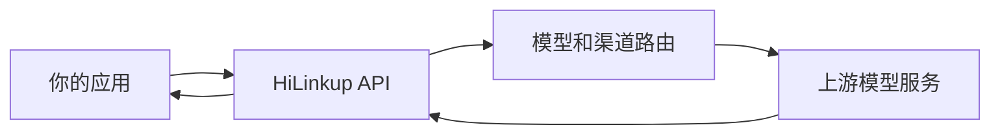

HiLinkup 使用统一模型 ID 接收请求，并将请求路由到对应的可用渠道。调用方主要负责选择模型和定义业务级回退。

## 请求路径

## 调用方应负责

- 使用当前可用的模型 ID。
- 为关键模型设置业务级备用模型。
- 设置总超时和有限重试。
- 记录请求 ID、模型、延迟和结果状态。
- 在切换模型时重新验证工具调用和结构化输出。

<Note>
  同一模型名称在不同上游渠道上可能存在参数、上下文和工具调用差异。生产评测应覆盖实际完整请求，而不是只测试一句简单对话。
</Note>
